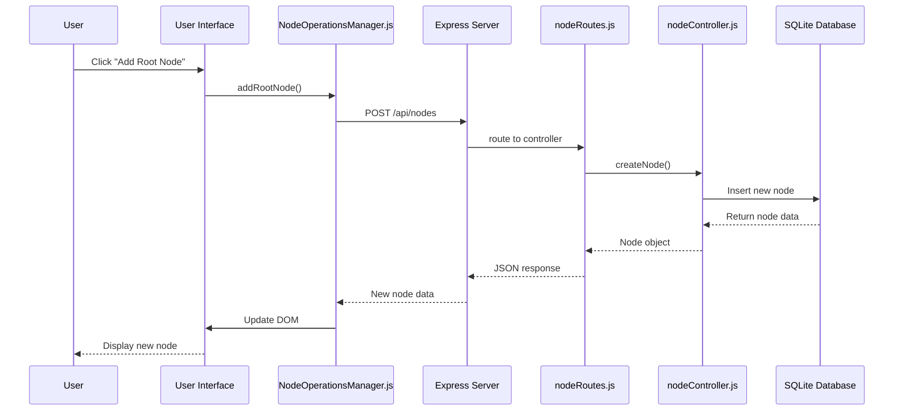

# Node Operations Architecture

## Overview
This document describes the architectural design of node operations in the Luhmann-Roam system, detailing the flow from user interaction to data persistence.

## Architecture Layers

### 1. Client Layer
- **Component**: Frontend UI in browser
- **Technology**: Vanilla JavaScript, HTML, CSS
- **Main Files**: 
  - `public/js/app.js`: Main application logic
  - `public/js/nodeOperationsManager.js`: Node operations handler
  - `public/index.html`: Main HTML template

### 2. Communication Layer
- **Protocol**: HTTP/HTTPS
- **Format**: JSON over RESTful API
- **Authentication**: [Details if applicable]

### 3. Server Layer
- **Component**: Express.js server
- **Technology**: Node.js, Express
- **Main Files**:
  - `server.js`: Main server setup
  - `routes/nodeRoutes.js`: Node operation route definitions
  - `controllers/nodeController.js`: Node operation logic

### 4. Persistence Layer
- **Component**: SQLite database
- **Technology**: SQLite3
- **Main Files**:
  - `database.js`: Database connection and utilities
  - `markdown/`: Directory for storing markdown content

## System Interaction Flow

### Node Creation Flow
1. **User Interface Interaction**: 
   - User clicks "Add Root Node" or "Add Child" button
   - `nodeOperationsManager.js` handles click event

2. **Client-Side Processing**:
   - `nodeOperationsManager.addRootNode()` or `addChildNode()` called
   - Prepares request payload with node data

3. **API Request**:
   - HTTP POST to `/api/nodes`
   - JSON payload with node details

4. **Server-Side Routing**:
   - `nodeRoutes.js` routes request to `nodeController.createNode()`

5. **Business Logic**:
   - `nodeController.js` validates input
   - Generates UUID for new node
   - Sets creation timestamp

6. **Database Operation**:
   - SQL INSERT operation to nodes table
   - Returns newly created node data

7. **Response Handling**:
   - Server returns node data with 201 status
   - Client updates UI with new node
   - If optimization possible, direct DOM insertion
   - Otherwise, triggers full refresh via `fetchNodes()`

[Diagrams would be added here showing the flow visually]

### Node Update Flow
...

[Continue with other operations and diagrams...]